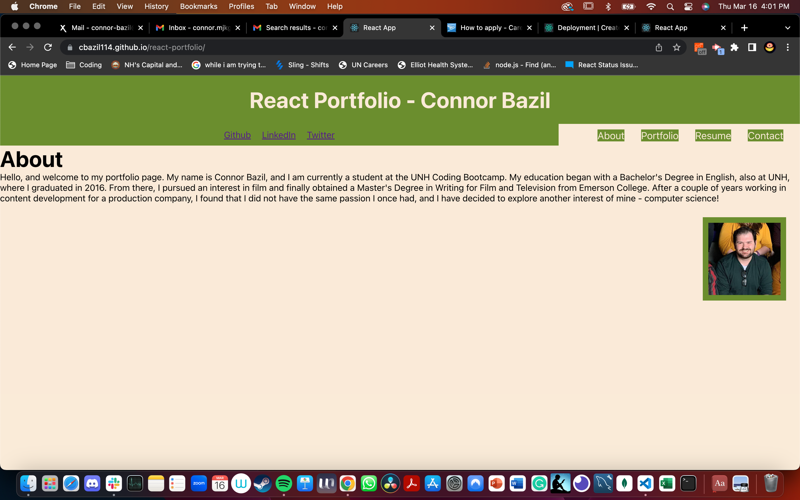

# react-portfolio

## Description

This application is an update to my single page portfolio repository, this time utilizing React to develop the app. 

## Table of Contents

  * [Description](#description)
  * [Installation](#installation)
  * [Usage](#usage)
  * [Contributing](#contributing)
  * [Deployment](#deployment)
  * [Screenshot](#screenshot)
  * [Questions](#questions)

## Installation

After cloning the repository to your local computer, you will then need the necessary dependencies. The simplest way is to access your folder via the command line/terminal, and use the code ```npm install``` to install everything you need. 

## Usage

After you've done the necessary installation, all you need to run the project is to use the following command:
```npm start```. You can use the application once started to run tests. 

## Contributions

The repository is public, and can be accessed, and adjusted, by anyone with a Github account.

## Deployment

The GitHub application can be opened via GitHub Pages:
[GitHub](https://cbazil114.github.io/react-portfolio)

## Screenshots

Screenshots of the deployed application through GitHub Pages:




## Questions

  If you would like to see other projects, visit my Github page at: GitHub: https://github.com/cbazil114 
  <br>
  Do you have any questions? If so, contact me at: 
  <br>
  Email: connor-bazil@comcast.net